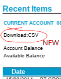

Co-operative Bank Statement Downloader
======================================

Adds a download link to Co-operative Bank online statements to
download your transactions in CSV format.

This is safe to use, as you log into your online banking account
normally and all processing is done locally in your browser.

Adapted from [Uncoop Me!][uncoop-me], a bookmarket created by
Marc Palmer which does the same job. It stopped working for me (due to
[mixed content blocking][mixed-content]) so I converted it into this Firefox
extension. The original bookmarket also lets you download the data in
OFX format; this extension currently only does CSV, but OFX support
could be added.

Please report any issues [on GitHub][github]. Contributions welcome.

[uncoop-me]: http://uncoop.me/
[mixed-content]:
https://blog.mozilla.org/tanvi/2013/04/10/mixed-content-blocking-enabled-in-firefox-23/
[github]: https://github.com/ricklupton/coop-statement-downloader/issues
